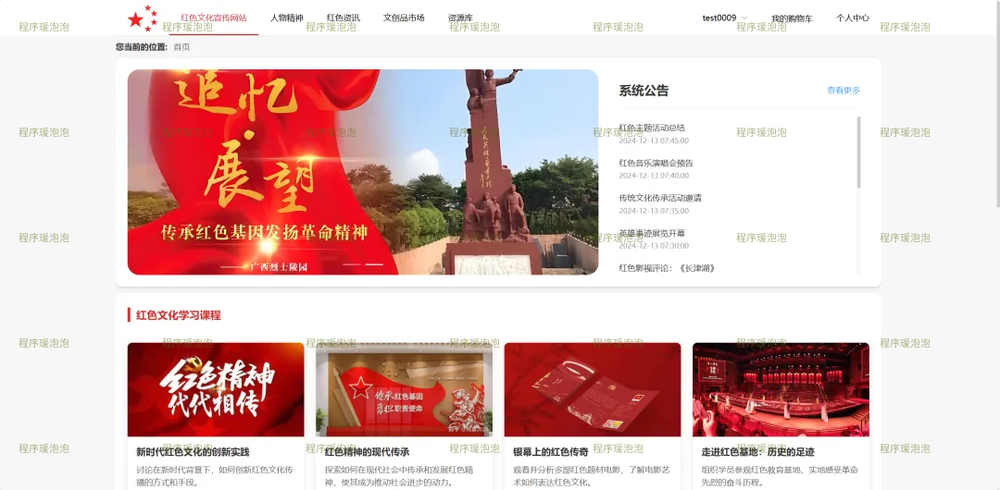
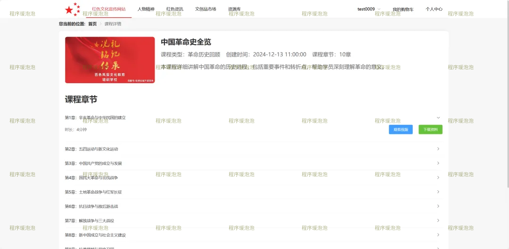
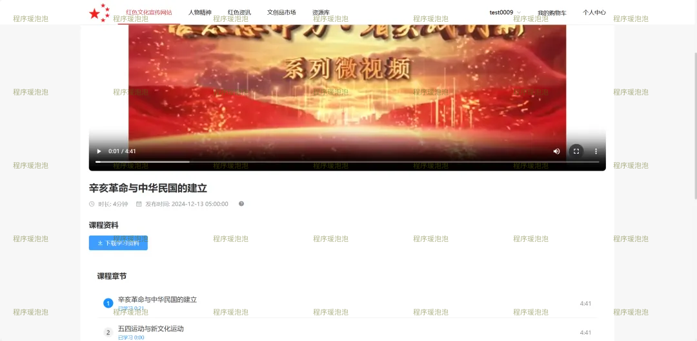
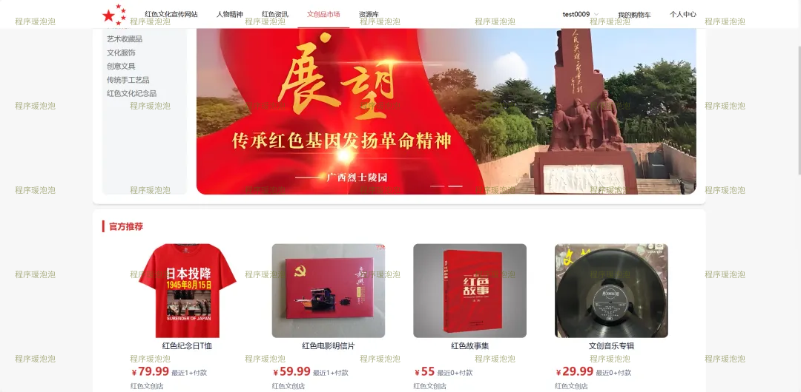
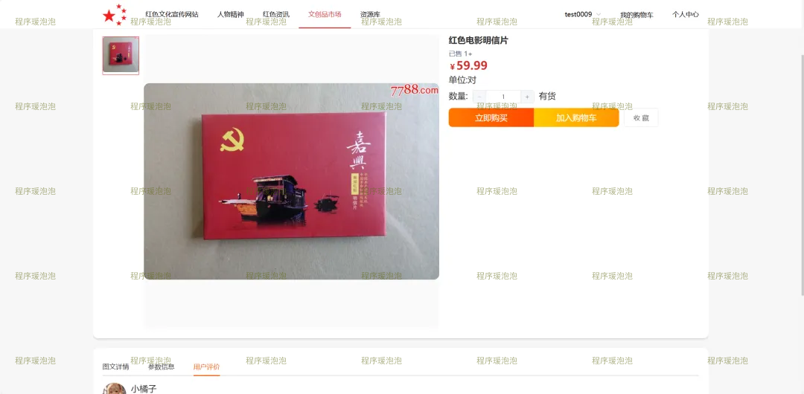
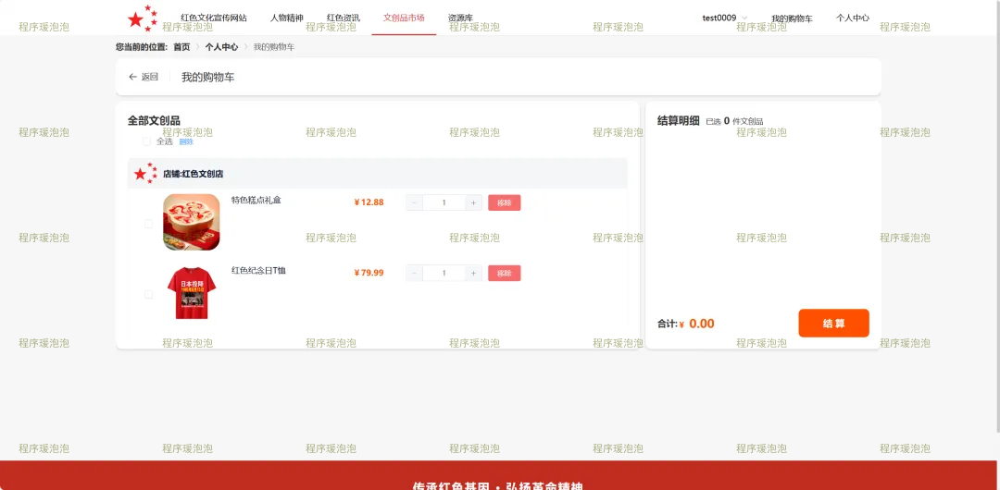
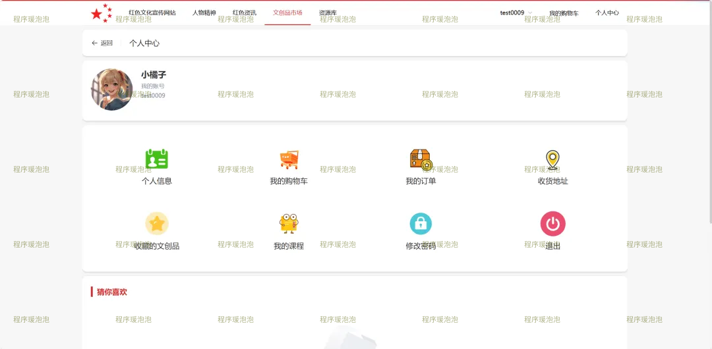
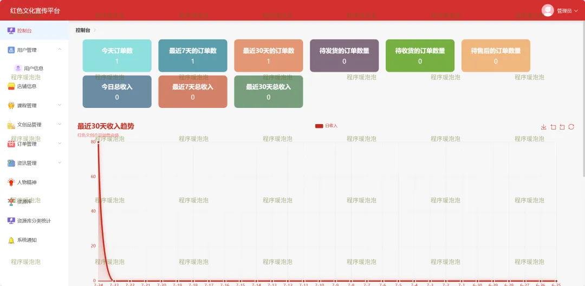
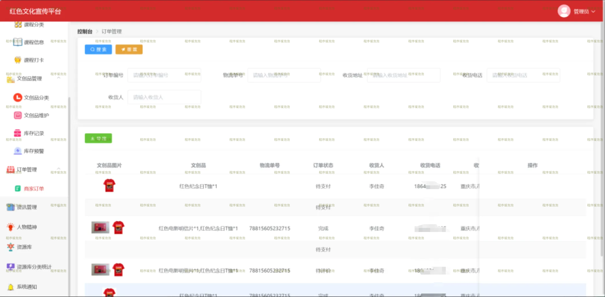
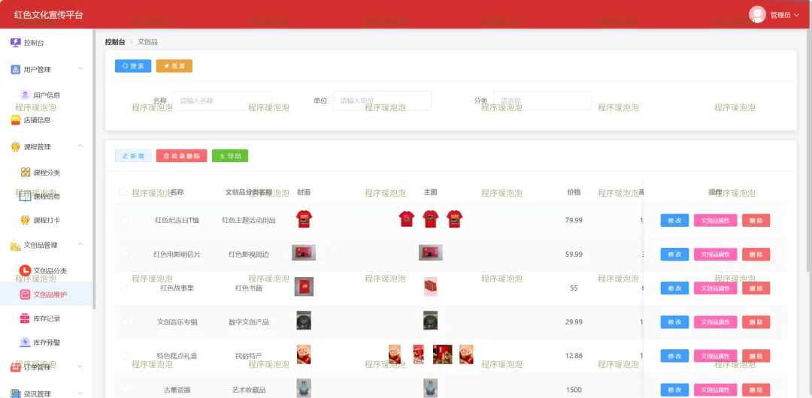

# redculture
红色文化宣传网站  亮点：支付宝沙盒支付、协同过滤算法、Echarts图形化分析； 角色：用户和管理员；
所有源码均本人开发，项目是前后端分离的，所有的项目都具备了完整的业务逻辑，不仅仅局限于基础的增删改查（CRUD）操作，系统亮点众多。

本文注重于计算机毕业设计选题指导，列出题目均有源码， 大家可以去【公众号】(毕业终点站)获取或者加我【qq】(2112698948)提意见(别忘记Star哟)。备注：git

声明：仅用于学习使用，请勿用于任何商业行为！

1.系统非商用，非开源，非无偿。

2.由本人开发，如需源码，请联系以下方式，qq:2112698948。

3.项目有很多，并未全部上传，如果未找到想要的，可直接咨询。
# 红色文化宣传网站

> 毕业设计 / 课程设计。B/S 架构，前后端分离，Vue.js + Spring Boot。核心亮点：**支付宝沙盒支付、协同过滤算法、ECharts 图形化分析**。

## 系统亮点

- 💰 **支付宝沙盒支付**：接入支付宝沙盒环境完成下单与支付流程，购物车结算、订单生成与支付状态回写，演示无需真实资金。
- 🎯 **协同过滤算法**：基于用户行为做文创品与内容推荐，浏览/购买越多的相似偏好越容易互相推荐。
- 📊 **ECharts 图形化分析**：后台数据统计页用图表展示用户、课程、文创品、订单等运营指标。

## 技术栈

| 端 | 技术与工具 |
| --- | --- |
| 前端 | Vue.js + ElementUI + Visual Studio Code |
| 后端 | Java 17 + Spring Boot + MyBatis-Plus + IDEA 2023.3.3 |
| 数据库 | MySQL 5.7/8.0 + Navicat 12 |
| 架构 | B/S 架构，前后端分离；运行环境 Win10/Win11、JDK17 |

## 角色与功能截图

系统两个角色：**用户 / 管理员**。以下为 10 张核心界面截图，如需更多展示，请联系我。

### 用户端

**1. 首页**

红色文化宣传站点首页，聚合课程、任务精神、人物精神、红色资讯、文创品等核心入口。

**2. 课程详情**

展示红色文化课程的介绍、章节与学习入口。

**3. 课程视频**

课程视频播放页面，支持在线观看学习内容。

**4. 文创品市场**

文创商品列表与推荐展示，结合协同过滤算法做个性化推荐。

**5. 商品详情**

展示文创品图文详情、规格、价格与加入购物车入口。

**6. 购物车**

购物车清单与结算入口，衔接支付宝沙盒支付流程。

**7. 个人中心**

个人资料、我的订单、收藏与学习记录等入口。

其他用户端功能：任务精神、人物精神详情、红色资讯等浏览与学习模块。

### 管理员端

**1. 数据统计（Echarts）**

后台数据统计页，通过 ECharts 图表展示平台运营指标。

**2. 商家订单**

订单列表与状态管理，覆盖支付、发货、完成等流转环节。

**3. 文创品管理**

文创商品信息维护、上下架与库存相关管理。

其他管理员端功能：用户管理、店铺管理、课程管理、库存记录、资讯信息、人物精神、资源库。

## 数据库

配套初始化 SQL（MySQL 5.7/8.0），覆盖用户、课程与视频、任务精神与人物精神、红色资讯、文创品与店铺、购物车与订单、库存记录、资源库等模块，管理员端数据统计基于上述业务表聚合。

## 运行说明

1. 导入数据库 SQL（MySQL 5.7/8.0）。
2. 后端改 `application.yml` 数据库连接与支付宝沙盒配置（appId、密钥、网关）。
3. 后端 IDEA 打开运行（JDK17）；前端 VS Code `npm install` → `npm run serve`。
4. 访问前端地址，默认账号见 SQL 初始化数据。

## 截图清单

| 序号 | 文件 | 说明 |
| --- | --- | --- |
| 01 | images/01-home.png | 首页 |
| 02 | images/02-course-detail.png | 课程详情 |
| 03 | images/03-course-video.png | 课程视频 |
| 04 | images/04-market.png | 文创品市场（协同过滤推荐） |
| 05 | images/05-product-detail.png | 商品详情 |
| 06 | images/06-cart.png | 购物车（沙盒支付流程） |
| 07 | images/07-profile.png | 个人中心 |
| 08 | images/08-admin-stats.png | 数据统计（Echarts） |
| 09 | images/09-orders.png | 商家订单 |
| 10 | images/10-product-manage.png | 文创品管理 |

> 截图只放 10 张核心页，防止被盗图。如需补图可从源项目语雀文档另存。

